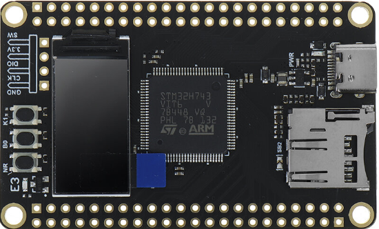

# STM32-LittleFS-QSPI

<p align="center">
  
</p>

This repository contains a simple Indirect/Polling Littefs port using the QSPI interface on a **STM32H743** development board. This is a continuation of the SPI based version which you can [find here](https://github.com/htminuslab/STM32-LittleFS-SPI).

I used the QSPI driver from [Boring Tech](https://github.com/osos11-Git/STM32H743VIT6_Boring_TECH_QSPI)

## LittleFS test

As with the SPI version I again used a modified Raspberry pico example I found on the web. In this case I added a timer (timer4) so I could measure the difference in performance between SPI and QSPI. I also added some defines to change the test as shown below: 

```C
#define NUMBER_OF_FILES		8   			// Max 32
#define FILE_SIZE			8192			// Test file size used in bytes
#define FILE_DEBUG			1				// Show test file messages, disable for benchmark
```

If the FILE_DEBUG is defined the test will print which files are opened/renamed and deleted. It also list the directory between the tests. To avoid the UART (printf) skewing the results you can disable the printf statements by commenting out the FILE_DEBUG define.

```
QUAD SPI Test, CPU clk=480MHz

littlefs version  = 20009
Flash Identifier  = 0x00ef4017
64bits Identifier = 0xdf635c76c73a1b29

Read SFDP Table:
 S  F  D  P 05 01 00 ff 00 05 01 10 80 00 00 ff ff ff ff ff ff ff ff ff ff ff ff ff ff ff ff ff
ff ff ff ff ff ff ff ff ff ff ff ff ff ff ff ff ff ff ff ff ff ff ff ff ff ff ff ff ff ff ff ff
ff ff ff ff ff ff ff ff ff ff ff ff ff ff ff ff ff ff ff ff ff ff ff ff ff ff ff ff ff ff ff ff
ff ff ff ff ff ff ff ff ff ff ff ff ff ff ff ff ff ff ff ff ff ff ff ff ff ff ff ff ff ff ff ff
e5 20 f9 ff ff ff ff 03 44 eb 08 6b 08 3b 42 bb fe ff ff ff ff ff 00 00 ff ff 40 eb 0c 20 0f 52
10 d8 00 00 36 02 a6 00 82 ea 14 c4 e9 63 76 33 7a 75 7a 75 f7 a2 d5 5c 19 f7 4d ff e9 30 f8 80
ff ff ff ff ff ff ff ff ff ff ff ff ff ff ff ff ff ff ff ff ff ff ff ff ff ff ff ff ff ff ff ff
ff ff ff ff ff ff ff ff ff ff ff ff ff ff ff ff ff ff ff ff ff ff ff ff ff ff ff ff ff ff ff ff

Mount littlefs and start timer

lfs_format - returned: 0
lfs_mount  - returned: 0
Write to File F0.tst
Write to File F1.tst
Write to File F2.tst
Write to File F3.tst
Write to File F4.tst
Write to File F5.tst
Write to File F6.tst
Write to File F7.tst
               .
              ..
          F0.tst  8192
          F1.tst  8192
          F2.tst  8192
          F3.tst  8192
          F4.tst  8192
          F5.tst  8192
          F6.tst  8192
          F7.tst  8192

Blocks 2048, block size 4096, used 26
lfs_mount  - returned: 0
FS: blocks 2048, block size 4096, used 26
Rename from F0.tst to R0.tst
Rename from F1.tst to R1.tst
Rename from F2.tst to R2.tst
Rename from F3.tst to R3.tst
Rename from F4.tst to R4.tst
Rename from F5.tst to R5.tst
Rename from F6.tst to R6.tst
Rename from F7.tst to R7.tst
               .
              ..
          R0.tst  8192
          R1.tst  8192
          R2.tst  8192
          R3.tst  8192
          R4.tst  8192
          R5.tst  8192
          R6.tst  8192
          R7.tst  8192

Blocks 2048, block size 4096, used 26
FS: blocks 2048, block size 4096, used 26
Reopen Filename=R0.tst
File R0.tst removed
Reopen Filename=R1.tst
File R1.tst removed
Reopen Filename=R2.tst
File R2.tst removed
Reopen Filename=R3.tst
File R3.tst removed
Reopen Filename=R4.tst
File R4.tst removed
Reopen Filename=R5.tst
File R5.tst removed
Reopen Filename=R6.tst
File R6.tst removed
Reopen Filename=R7.tst
File R7.tst removed
               .
              ..

Blocks 2048, block size 4096, used 2
FS: blocks 2048, block size 4096, used 2
lfs test done, runtime 2060 ms
```

\#define FILE_DEBUG commented out:

```
QUAD SPI Test, CPU clk=480MHz

littlefs version  = 20009
Flash Identifier  = 0x00ef4017
64bits Identifier = 0xdf635c76c73a1b29

Read SFDP Table:
 S  F  D  P 05 01 00 ff 00 05 01 10 80 00 00 ff ff ff ff ff ff ff ff ff ff ff ff ff ff ff ff ff
ff ff ff ff ff ff ff ff ff ff ff ff ff ff ff ff ff ff ff ff ff ff ff ff ff ff ff ff ff ff ff ff
ff ff ff ff ff ff ff ff ff ff ff ff ff ff ff ff ff ff ff ff ff ff ff ff ff ff ff ff ff ff ff ff
ff ff ff ff ff ff ff ff ff ff ff ff ff ff ff ff ff ff ff ff ff ff ff ff ff ff ff ff ff ff ff ff
e5 20 f9 ff ff ff ff 03 44 eb 08 6b 08 3b 42 bb fe ff ff ff ff ff 00 00 ff ff 40 eb 0c 20 0f 52
10 d8 00 00 36 02 a6 00 82 ea 14 c4 e9 63 76 33 7a 75 7a 75 f7 a2 d5 5c 19 f7 4d ff e9 30 f8 80
ff ff ff ff ff ff ff ff ff ff ff ff ff ff ff ff ff ff ff ff ff ff ff ff ff ff ff ff ff ff ff ff
ff ff ff ff ff ff ff ff ff ff ff ff ff ff ff ff ff ff ff ff ff ff ff ff ff ff ff ff ff ff ff ff

Mount littlefs and start timer

lfs_format - returned: 0
lfs_mount  - returned: 0
lfs_mount  - returned: 0
lfs test done, runtime 1900 ms
```


On the test case QSPI was nearly 3 times as fast as SPI: 

```
SPI @120MHz:
lfs test done, runtime 5960 ms

QSPI @120MHz:
lfs test done, runtime 1900 ms
```

## Enhancements

The port can be improved by using DMA, unfortunately LittleFS can not work asynchronously which would be a better fit for DMA/IRQ type of interactions.  

## License

See the LICENSE file for details.


## Trademarks

STM32 is a registered trademark of STMicroelectronics International N.V.

